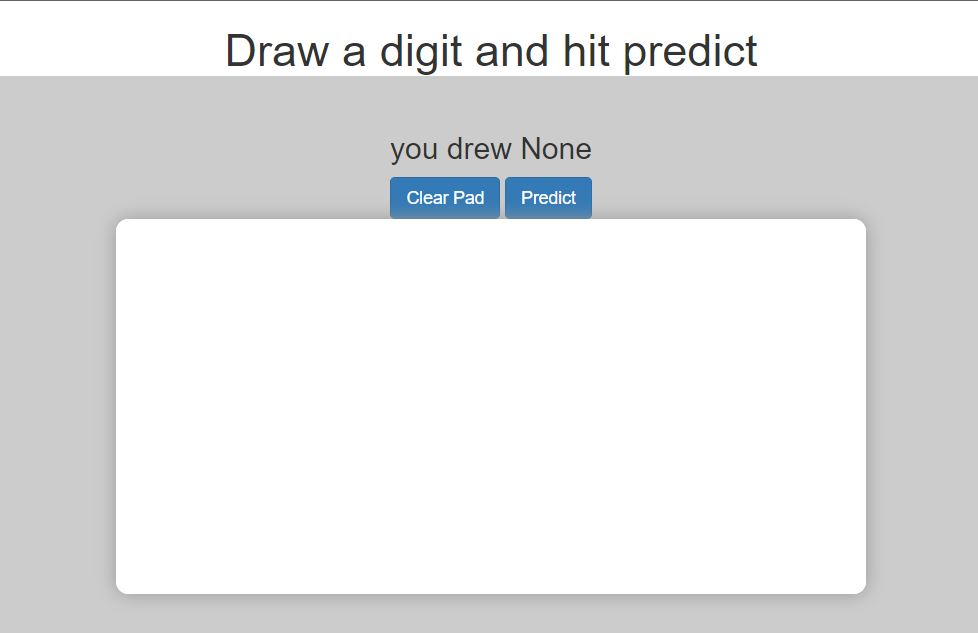
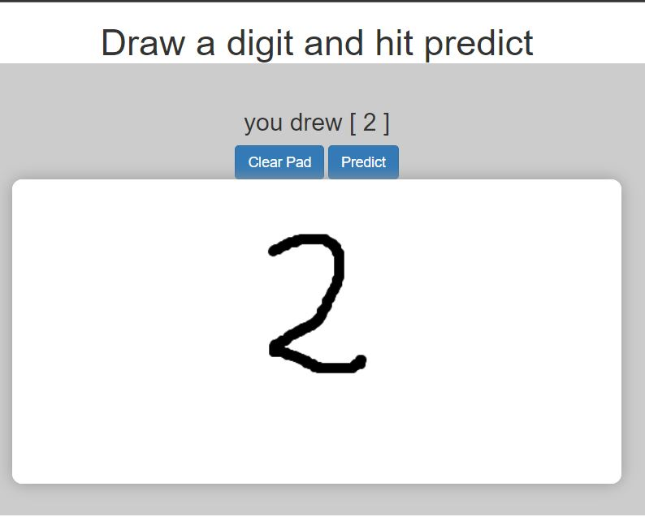
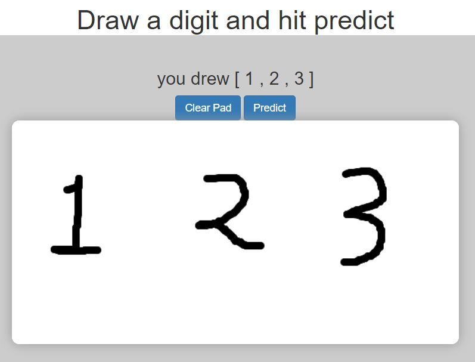

# Mnist_handwritten
An deep neural network traineed using mnist digits data is deployed on a flask webpage, where you can draw on a canvas and the model will predict the digit.

mnist.keras is a dumped model trained on local machine and another.keras is trained on colab. For front-end canvas is used as a sketchpad which is converted into dataUrl and sent to flask backend using ajax.

I tried deploying it on vercel but it took so long to deploy. Maybe because it uses large libraries such as tensorflow. I may work by only using tensorflow-cpu but that would take another 40 min to deploy. So, here are some snapshots of website.
1.

2.

3.
